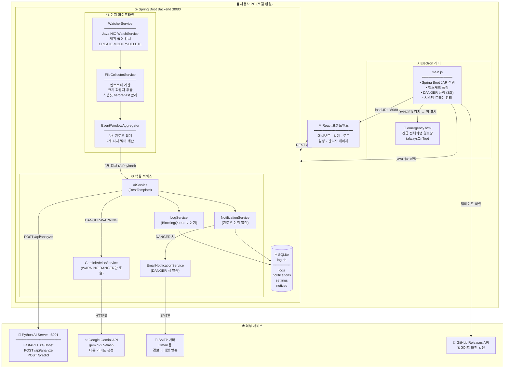
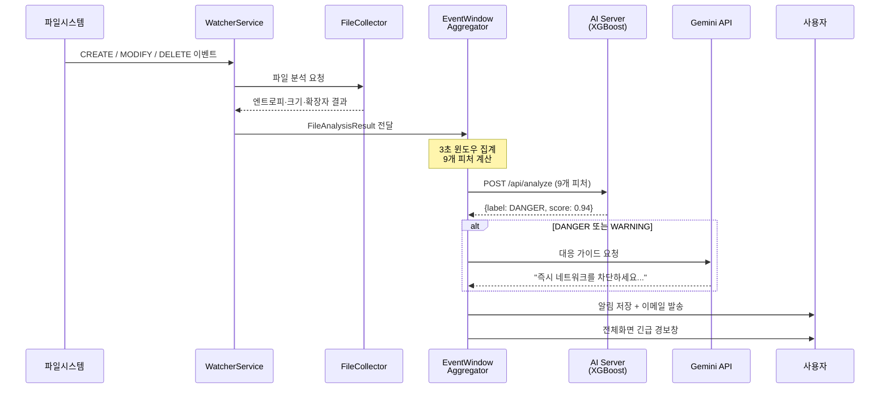

# WatchService Agent — 시스템 아키텍처 문서

> 작성일: 2026-04-12  
> 버전: 1.0  
> 대상: 랜섬웨어 실시간 탐지 시스템 전반

---

## 전체 시스템 구성도



---

## 탐지 흐름 요약



---

## 0. 사용자 관점에서 본 시스템 흐름

시스템이 어떤 순서로 동작하는지, 사용자의 행동과 연결해서 설명한다.

### 0-1. 앱 설치 및 최초 실행

```
[사용자]
    │
    │ 1. Electron 앱 실행
    ▼
[Electron main.js]
    │ 2. Spring Boot JAR 자동 실행 (java -jar)
    │ 3. 로딩 화면 표시 (loading.html)
    │ 4. /actuator/health 폴링 → Spring Boot 준비 완료 감지
    │ 5. 메인 창 표시 (http://localhost:8080 로드)
    ▼
[React 대시보드]
    │ 6. 사용자에게 보호 상태 "미감시" 표시
    │ 7. 감시 폴더가 없으면 설정 유도
```

> 사용자 입장에서는 앱을 실행하면 로딩 화면이 잠깐 뜨고 대시보드가 열린다.  
> 내부적으로는 Java 서버가 뜨는 시간(최대 60초)을 기다리는 것이다.

---

### 0-2. 감시 폴더 설정

```
[사용자]
    │
    │ 설정 → 감시 폴더 → 폴더 추가
    ▼
[React SettingFoldersPage]
    │ POST /api/settings/folders { path: "C:/Users/..." }
    ▼
[SettingsService → SQLite watched_folders 테이블 저장]
    │
    │ POST /api/watcher/start { path: "C:/Users/..." }
    ▼
[WatcherService]
    │ - Java NIO WatchService로 해당 폴더 + 하위 폴더 전체 등록
    │ - ownerKey("default" 고정값)로 이 사용자의 감시 스레드 시작
    │ - 이후 파일 이벤트가 발생하면 탐지 파이프라인으로 진입
    ▼
[대시보드] 보호 상태 → "감시 중" 표시
```

> 예외 규칙도 설정 가능 (설정 → 예외 규칙).  
> 특정 폴더, 확장자, 파일명 패턴을 등록하면 해당 파일 이벤트는 AI 분석에서 제외된다.

---

### 0-3. 정상 작업 중 — 탐지 없음 (SAFE)

```
[사용자가 일반 문서 파일 수정]
    │
    │ OS가 파일 변경 이벤트 발생 (MODIFY)
    ▼
[WatcherService] → [FileCollectorService]
    │ 파일 크기, 엔트로피, 확장자 측정
    │ (예: 엔트로피 4.5 → 평범한 텍스트/문서)
    ▼
[EventWindowAggregator]
    │ 3초 윈도우 내 이벤트 누적
    │ 9개 피처 계산
    │   fileWriteCount=1, entropyDiffMean=0.02, randomExtensionFlag=0, ...
    ▼
[AI 서버 POST /api/analyze]
    │ XGBoost 예측: score=0.08 → SAFE
    ▼
[LogService] 이벤트 로그 저장 (ai_label=SAFE)
[NotificationService] 알림 저장 (ai_label=SAFE)
    ▼
[대시보드] 최근 이벤트 목록에 SAFE 항목 표시
```

> 사용자는 아무 알림도 받지 않는다.  
> 로그/알림 페이지에서 이력을 조회할 수 있다.

---

### 0-4. 랜섬웨어 의심 행위 감지 — WARNING / DANGER

```
[랜섬웨어 프로세스가 파일들을 빠르게 암호화 중]
    │
    │ 수십~수백 개의 CREATE/MODIFY/DELETE 이벤트 연속 발생
    ▼
[WatcherService] → [FileCollectorService]
    │ 엔트로피 급등 감지
    │   before=4.2  →  after=7.8  (암호화된 파일은 엔트로피가 7.0 이상)
    │ 확장자 변경: .docx → .wncry  (suspicious 확장자)
    │ 크기 변화, rename(DELETE+CREATE 쌍) 다수 감지
    ▼
[EventWindowAggregator] (3초 윈도우)
    │ 9개 피처 계산:
    │   fileWriteCount=47
    │   fileDeleteCount=12
    │   fileRenameCount=38    ← .wncry로 rename 탐지
    │   fileEncryptLikeCount=45  ← 엔트로피↑ + 확장자변화
    │   randomExtensionFlag=1    ← .wncry 3개 이상
    │   entropyDiffMean=3.52
    ▼
[AI 서버 POST /api/analyze]
    │ XGBoost 예측: score=0.94 → DANGER
    │ topFamily: WannaCry (prob=0.89)
    ▼
[GeminiAdviceService]
    │ DANGER이므로 Gemini API 호출
    │ "즉시 네트워크 연결을 차단하고 외장드라이브를 제거하세요..." 가이드 생성
    ▼
[LogService] 로그 저장 (ai_label=DANGER, top_family=WannaCry)
[NotificationService] 알림 저장
[EmailNotificationService] SMTP로 경고 이메일 발송 (SMTP 설정된 경우)
    ▼
[Electron main.js — DANGER 폴링]
    │ 3초마다 GET /notifications?level=DANGER&size=1 폴링
    │ 새 DANGER ID 감지 →
    ▼
[긴급 전체화면 경보창 표시 (emergency.html)]
    │ 탐지 시각, 랜섬웨어 패밀리, 대응 가이드 요약 표시
    │ 화면 앞에 항상 표시 (alwaysOnTop)
    ▼
[사용자] 경보 확인 → 대시보드에서 상세 내용 확인
              → 알림 상세 페이지에서 영향받은 파일 목록, Gemini 가이드 전체 내용 확인
```

---

### 0-5. 사용자가 수동 스캔 실행

```
[사용자]
    │ 대시보드 → 수동 스캔 버튼 클릭
    ▼
[ScanService]
    │ - 백그라운드 스레드에서 감시 폴더 전체 순회
    │ - 각 파일의 엔트로피, 크기, 확장자 측정
    │ - 진행률 실시간 업데이트 (ScanJob 상태)
    │ - SCAN 이벤트 타입으로 로그 저장 (AI 윈도우 집계 제외)
    ▼
[프론트엔드 ScanControlPanel] GET /api/scan/{id} 폴링으로 진행률 표시
    ▼
[완료 시] ScanResultModal로 결과 팝업 표시
```

---

### 0-6. 관리자 운영

```
[관리자]
    │ /admin/login 에서 ADMIN_USERNAME / ADMIN_PASSWORD(BCrypt) 입력
    ▼
[AdminAuthService] BCrypt 검증 → HTTP 세션에 ADMIN_AUTH=true 저장
    │
    ├── 모든 세션의 로그/알림 조회 (ownerKey 구분 없이 전체)
    ├── 공지사항 작성/수정/삭제 → 사용자에게 /notice 페이지에 표시
    ├── 사용 가이드 관리 → /settings/guide 페이지에 표시
    ├── 피드백 확인 (사용자가 /settings/feedback에서 제출한 내용)
    ├── 활성 세션 목록 확인
    └── 시스템 정보 확인 (JVM 힙, OS, 프로세스 정보)
```

---

### 0-7. 앱 종료

```
[사용자]
    │ 창 닫기 버튼 클릭
    ▼
[Electron] 창을 숨김 (hide) — 앱 종료 아님, 트레이로 이동
    │
    │ 시스템 트레이 아이콘 → "종료" 클릭
    ▼
[app.before-quit]
    │ DANGER 폴링 타이머 정리
    │ springProcess.kill('SIGTERM') → Spring Boot JVM 종료
    ▼
[앱 완전 종료]
```

---

### 요약: 사용자가 보는 것 vs 내부에서 일어나는 것

| 사용자가 보는 것 | 내부에서 일어나는 것 |
|-----------------|---------------------|
| 앱 실행 후 로딩 | Electron이 Spring Boot JAR 시작, 헬스체크 폴링 |
| 대시보드에 "감시 중" | NIO WatchService 스레드 + ownerKey별 상태 관리 |
| 이벤트 로그 항목 | 3초 윈도우 집계 → XGBoost 예측 → SQLite 저장 |
| WARNING/DANGER 알림 | score 계산, Gemini 가이드 생성, 이메일 발송 |
| 긴급 전체화면 경보 | Electron이 3초마다 DANGER 폴링, 새 ID 감지 시 창 띄움 |
| 랜섬웨어 패밀리 이름 | XGBoost top-k 분류, 후처리 카테고리 매핑 |
| 수동 스캔 진행률 | 백그라운드 스레드, 클라이언트 폴링 |
| 앱 업데이트 확인 | Electron IPC → GitHub Releases API 조회 |

---

## 1. 전체 시스템 구성

```
┌────────────────────────────────────────────────────────────────────┐
│                        사용자 PC (로컬)                             │
│                                                                    │
│  ┌─────────────────────────────────────────────────────────────┐  │
│  │                    Electron (watchservice_electron)          │  │
│  │                                                             │  │
│  │  main.js ─── Spring Boot JAR 실행 (java -jar)              │  │
│  │           ─── 헬스체크 폴링 (/actuator/health)              │  │
│  │           ─── DANGER 알림 폴링 (3초 간격)                   │  │
│  │           ─── 긴급 전체화면 경보 창 (emergency.html)        │  │
│  │           ─── 시스템 트레이 아이콘                           │  │
│  │           ─── IPC: get-app-version / check-for-updates      │  │
│  │                                                             │  │
│  │  preload.js ─── contextBridge → window.electronAPI          │  │
│  └────────────────────┬────────────────────────────────────────┘  │
│                       │ loadURL(http://localhost:8080)             │
│                       ▼                                            │
│  ┌─────────────────────────────────────────────────────────────┐  │
│  │              Spring Boot (watchservice_be, :8080)           │  │
│  │                                                             │  │
│  │  ┌──────────┐  ┌────────────┐  ┌──────────────────────┐   │  │
│  │  │ Watcher  │→ │ Collector  │→ │ EventWindowAggregator │   │  │
│  │  │ Service  │  │ Service    │  │ (3초 윈도우, 9피처)   │   │  │
│  │  └──────────┘  └────────────┘  └──────────┬───────────┘   │  │
│  │  NIO WatchSvc  EntropyAnalyzer             │               │  │
│  │  재귀 폴더감시  FileSnapshotStore           │ AiPayload     │  │
│  │                                            ▼               │  │
│  │                                  ┌──────────────────┐      │  │
│  │                                  │    AiService     │      │  │
│  │                                  │  RestTemplate    │      │  │
│  │                                  └────────┬─────────┘      │  │
│  │                                           │                │  │
│  │  ┌──────────────┐  ┌──────────────────┐  │                │  │
│  │  │  LogService  │  │NotificationService│  │                │  │
│  │  │ (async queue)│  │ (윈도우 단위 알림)│  │                │  │
│  │  └──────┬───────┘  └──────────────────┘  │                │  │
│  │         │                                 │                │  │
│  │         ▼                                 │                │  │
│  │  ┌─────────────────────────────────────┐  │                │  │
│  │  │           SQLite (log.db)           │  │                │  │
│  │  │  logs / notifications / settings    │  │                │  │
│  │  │  notices / feedbacks / guides       │  │                │  │
│  │  └─────────────────────────────────────┘  │                │  │
│  │                                            │                │  │
│  │  [REST API Layer]                          │                │  │
│  │  WatcherController, LogController,         │                │  │
│  │  NotificationController, SettingsController│                │  │
│  │  AdminAuth* / UserAuth*                    │                │  │
│  └────────────────────────────────────────────┘                │  │
│                                                │                  │
└────────────────────────────────────────────────┼──────────────────┘
                                                 │ HTTP POST
                                                 ▼
               ┌──────────────────────────────────────────────────┐
               │         Python AI Server (:8001)                 │
               │         FastAPI + XGBoost                        │
               │                                                  │
               │  POST /api/analyze  ── 랜섬웨어 판정 (9피처)     │
               │  POST /predict      ── 패밀리 분류 (top-k)       │
               │  GET  /health                                    │
               │                                                  │
               │  artifacts/ : model_xgb.json, features.json,    │
               │               classes.json                       │
               └──────────────────────────────────────────────────┘

                                    + HTTPS (외부)
               ┌──────────────────────────────────────────────────┐
               │   Google Gemini API (gemini-2.5-flash)           │
               │   WARNING/DANGER 탐지 시 대응 가이드 생성         │
               └──────────────────────────────────────────────────┘

               ┌──────────────────────────────────────────────────┐
               │   GitHub Releases API                            │
               │   GET /repos/{owner}/{repo}/releases/latest      │
               │   업데이트 버전 확인 (Electron IPC)              │
               └──────────────────────────────────────────────────┘
```

---

## 2. 핵심 탐지 파이프라인

랜섬웨어 탐지의 전체 데이터 흐름:

```
[파일시스템 이벤트]
        │
        │ Java NIO WatchService
        │ CREATE / MODIFY / DELETE
        ▼
┌─────────────────────────────────────────────────┐
│  WatcherService                                 │
│  - 감시 폴더 재귀 등록 (WatchKey → Path 맵)    │
│  - ownerKey("default" 고정값) 기반 단일 감시 스레드  │
│  - 예외 규칙 필터링 (SettingsService)           │
└───────────────────────┬─────────────────────────┘
                        │ FileAnalysisResult (raw)
                        ▼
┌─────────────────────────────────────────────────┐
│  FileCollectorService                           │
│  - 파일 크기 읽기 (Files.size)                 │
│  - 엔트로피 계산 (EntropyAnalyzer)             │
│    · >4KB: 앞40% / 중간40% / 끝20% 3구간 샘플링│
│    · ≤4KB: 앞부분 순차 읽기                    │
│  - 확장자 추출 (extBefore / extAfter)          │
│  - FileSnapshotStore 조회/갱신                 │
│    · baseline: putIfAbsent (최초 상태)         │
│    · last:     항상 갱신 (직전 상태)           │
└───────────────────────┬─────────────────────────┘
                        │ FileAnalysisResult (분석됨)
                        ▼
┌─────────────────────────────────────────────────┐
│  EventWindowAggregator (3초 윈도우)             │
│                                                 │
│  SCAN 등 비표준 이벤트 → 로그만 저장, 집계 제외│
│                                                 │
│  [윈도우 집계 — 9개 XGBoost 피처 계산]         │
│  ① fileReadCount      세션 기반 접근 수        │
│  ② fileWriteCount     내용 변경 기반 쓰기 수   │
│  ③ fileDeleteCount    DELETE 이벤트 수         │
│  ④ fileRenameCount    DELETE+CREATE 점수 매칭  │
│  ⑤ fileEncryptLikeCount  엔트로피↑+크기/확장자│
│  ⑥ changedFilesCount  변경된 고유 파일 수      │
│  ⑦ randomExtensionFlag  suspicious 확장자 ≥2  │
│  ⑧ entropyDiffMean    유의미한 엔트로피 변화 μ │
│  ⑨ fileSizeDiffMean   크기 변화 μ (bytes)      │
└───────────────────────┬─────────────────────────┘
                        │ AiPayload (9개 필드)
                        ▼
┌─────────────────────────────────────────────────┐
│  AiService                                      │
│  POST http://ai-server:8001/api/analyze         │
│  ConnectTimeout: 5s / ReadTimeout: 15s          │
└──────┬──────────────────────────────────────────┘
       │ AiResponse {label, score, detail, topk}
       ▼
┌─────────────────────────────────────────────────┐
│  GeminiAdviceService                            │
│  - SAFE → 고정 문구 반환 (API 호출 안 함)       │
│  - WARNING / DANGER → Gemini API 호출           │
│    대응 가이드 텍스트 생성                      │
└───────────────────────┬─────────────────────────┘
                        │ AiResult (+ guidance)
                        ▼
            ┌───────────┴────────────┐
            ▼                        ▼
  LogService.saveAsync()     NotificationService
  큐 → LogWriterWorker       .saveNotification()
  → SQLite logs 테이블       → SQLite notifications 테이블
```

---

## 3. 백엔드 패키지 구조

```
com.watchserviceagent.watchservice_agent/
│
├── watcher/
│   ├── WatcherService          NIO WatchService, ownerKey별 독립 스레드
│   ├── WatcherController       GET/POST /api/watcher/** (시작/중지/상태)
│   └── dto/WatcherEventRecord
│
├── collector/
│   ├── FileCollectorService    파일 분석 오케스트레이터
│   ├── business/
│   │   ├── EntropyAnalyzer     Shannon 엔트로피 계산 (3구간 샘플링)
│   │   └── HashCalculator      SHA-256 해시 (미사용 시 옵션)
│   ├── snapshot/
│   │   ├── FileSnapshotStore   baseline / last 스냅샷 (ConcurrentHashMap)
│   │   └── SnapshotConfig      @Bean 등록
│   └── dto/FileAnalysisResult  이벤트 분석 결과 DTO
│
├── analytics/
│   └── EventWindowAggregator  3초 윈도우 집계 + 9피처 계산
│
├── ai/
│   ├── AiService              AI 서버 HTTP 통신 (analyze + family)
│   ├── GeminiAdviceService    Gemini LLM 가이드 생성
│   ├── AiController           POST /api/ai/analyze (직접 분석 요청용)
│   ├── FamilyInfoController   GET /api/family/**
│   ├── domain/AiResult
│   └── dto/  AiPayload / AiResponse / FamilyPredictRequest·Response
│
├── alerts/
│   ├── NotificationService     윈도우 단위 알림 저장/조회
│   ├── NotificationRepository  SQLite CRUD (Spring JDBC)
│   ├── NotificationController  GET /api/notifications/**
│   ├── AlertService            전체 알림 통계/조회
│   ├── AlertController         GET /api/alerts/**
│   └── EmailNotificationService  DANGER 탐지 시 SMTP 발송
│
├── storage/
│   ├── LogService              로그 비즈니스 로직
│   ├── LogWriterWorker         BlockingQueue 기반 비동기 저장
│   ├── LogRepository           SQLite CRUD
│   ├── LogController           GET/DELETE /api/logs/**
│   └── dto/  LogResponse / LogPageResponse / LogExportRequest
│
├── settings/
│   ├── SettingsService         감시 폴더 + 예외 규칙 CRUD
│   ├── SettingsRepository      SQLite CRUD
│   ├── SettingsController      /api/settings/**
│   └── domain/  WatchedFolder / ExceptionRule
│
├── scan/
│   ├── ScanService             수동 스캔 (비동기, 진행률 추적)
│   ├── ScanController          POST /api/scan / GET /api/scan/{id}
│   └── domain/  ScanJob / ScanStatus
│
├── dashboard/
│   ├── DashboardController     GET /api/dashboard/summary
│   └── dto/DashboardSummaryResponse
│
├── admin/
│   ├── AdminAuthService        BCrypt 검증 (관리자)
│   ├── AdminAuthInterceptor    /api/admin/** 세션 인증 가드
│   ├── AdminWebConfig          인터셉터 등록
│   ├── UserAuthService         BCrypt / 평문 하이브리드 검증 (일반 사용자)
│   ├── UserAuthInterceptor     선택적 사용자 인증 가드
│   ├── UserWebConfig           인터셉터 등록
│   ├── AdminAuthController     POST /api/admin/login·logout
│   ├── UserAuthController      POST /api/auth/login·logout
│   ├── AdminLogController      GET /api/admin/logs/**
│   ├── AdminAlertController    GET /api/admin/alerts/**
│   ├── AdminNoticeController   CRUD /api/admin/notices/**
│   ├── AdminSessionController  GET /api/admin/sessions
│   ├── AdminSystemController   GET /api/admin/system
│   ├── FeedbackController      POST /api/feedback (사용자) / GET /api/admin/feedbacks
│   ├── GuideController         GET /api/guides
│   └── domain/  Notice / Feedback
│
└── common/
    ├── ApiResponse<T>          통일 응답 형식 {success, data, message}
    ├── config/
    │   ├── SecurityConfig      Spring Security 설정
    │   ├── SqliteConfig        SQLite 데이터소스 + 스키마 초기화
    │   └── WebConfig           CORS 설정
    ├── exception/
    │   └── GlobalExceptionHandler  @ControllerAdvice
    └── util/
        ├── OwnerKeyUtil        항상 고정값 "default" 반환 (단일 사용자 데스크탑)
        └── SessionIdManager    세션 ID 파일 영속화
```

---

## 4. 프론트엔드 구조

```
watchservice_fe/src/
│
├── api/                         API 클라이언트 레이어
│   ├── HttpClient.js            fetch 래퍼 (REACT_APP_API_BASE_URL 기반)
│   ├── WatcherApi.js            감시 시작/중지/상태
│   ├── LogsApi.js               로그 조회/삭제/내보내기
│   ├── NotificationsApi.js      알림 조회/통계
│   ├── SettingApi.js            감시 폴더/예외 규칙 CRUD
│   ├── AdminApi.js              관리자 API (로그인/공지/피드백/세션)
│   ├── DashboardApi.js          대시보드 요약
│   └── ScanApi.js               수동 스캔 시작/진행률
│
├── hooks/                       커스텀 훅
│   ├── UseProtectionStatus.js   보호 상태 폴링
│   ├── UseLogs.js               로그 목록
│   ├── UseNotifications.js      알림 목록
│   ├── UseWatchedFolders.js     감시 폴더 목록
│   └── UseExceptions.js         예외 규칙 목록
│
├── layout/
│   └── MainLayout.jsx           HeaderBar + NavSidebar + 콘텐츠 영역
│
├── components/
│   ├── common/                  Toast, Modal, ConfirmModal, Button,
│   │                            ProgressBar, NavSidebar, HeaderBar,
│   │                            ProtectedRoute, UserProtectedRoute,
│   │                            AudioAlert, ErrorBoundary
│   ├── folders/                 FolderListManager, FolderPickerModal
│   ├── logs/                    LogTable, LogFilterBar, LogDetailModal
│   ├── notifications/           FamilyInfoModal, NotificationStatusChart
│   ├── protection/              ProtectionStatusBadge, RecentEventsPanel,
│   │                            ScanControlPanel
│   └── scan/                    ScanResultModal
│
└── pages/
    ├── mainboard/  MainBoardPage          /
    ├── notifications/
    │   ├── NotificationPage              /notifications
    │   ├── NotificationDetailPage        /notifications/:id
    │   └── NotificationStatsPage         /notifications/stats
    ├── logs/
    │   ├── LogsPage                      /logs
    │   ├── TopFilesPage                  /logs/top-files
    │   └── ExtensionStatsPage            /logs/extension-stats
    ├── notice/  UserNoticePage            /notice
    ├── auth/    UserLoginPage             /login
    ├── settings/
    │   ├── SettingHomePage               /settings
    │   ├── SettingFoldersPage            /settings/folders
    │   ├── SettingExceptionsPage         /settings/exceptions
    │   ├── SettingNotifyPage             /settings/notify
    │   ├── SettingEmailPage              /settings/email
    │   ├── SettingResetPage              /settings/reset
    │   ├── SettingUpdatePage             /settings/update  ← Electron IPC
    │   ├── SettingFeedbackPage           /settings/feedback
    │   └── SettingGuidePage              /settings/guide
    └── admin/
        ├── AdminLoginPage                /admin/login
        ├── AdminMainPage                 /admin/main
        ├── AdminFeedbackPage             /admin/feedback
        ├── AdminNoticePage               /admin/notification
        ├── AdminLogPage                  /admin/logs
        ├── AdminAlertPage                /admin/alerts
        ├── AdminSessionPage              /admin/sessions
        ├── AdminSystemPage               /admin/system
        └── AdminGuidePage                /admin/guide
```

---

## 5. 인증 구조

```
┌──────────────────────────────────────────────────────────────────┐
│                     인증 계층 (2-tier)                            │
│                                                                  │
│  ┌──────────────────────────────────────────────────────────┐   │
│  │   Tier 1 — 일반 사용자 인증 (선택적)                     │   │
│  │                                                          │   │
│  │   UserAuthInterceptor (UserWebConfig)                   │   │
│  │   적용 경로: 모든 /api/** (단, admin/login, auth/login 제외) │   │
│  │                                                          │   │
│  │   USER_AUTH_ENABLED=false (기본) → 통과                 │   │
│  │   USER_AUTH_ENABLED=true  → HTTP 세션의 USER_AUTH=true 확인 │   │
│  │                                                          │   │
│  │   UserAuthService.authenticate()                        │   │
│  │   - USER_PASSWORD가 $2a$ / $2b$ 로 시작 → BCrypt 검증  │   │
│  │   - 평문이면 equals 비교 + 경고 로그 출력               │   │
│  └──────────────────────────────────────────────────────────┘   │
│                                                                  │
│  ┌──────────────────────────────────────────────────────────┐   │
│  │   Tier 2 — 관리자 인증                                   │   │
│  │                                                          │   │
│  │   AdminAuthInterceptor (AdminWebConfig)                 │   │
│  │   적용 경로: /api/admin/** (단, /api/admin/login 제외)   │   │
│  │                                                          │   │
│  │   HTTP 세션의 ADMIN_AUTH=true 확인                       │   │
│  │   미통과 → 401 { success:false, message:"admin_auth_required" } │   │
│  │                                                          │   │
│  │   AdminAuthService.authenticate()                       │   │
│  │   - 항상 BCrypt 검증 (평문 비밀번호는 로그인 차단)       │   │
│  │   - 환경변수: ADMIN_USERNAME / ADMIN_PASSWORD            │   │
│  └──────────────────────────────────────────────────────────┘   │
│                                                                  │
│  ownerKey                                                         │
│  - OwnerKeyUtil: 항상 고정값 "default" 반환                      │
│    (단일 사용자 데스크탑 앱 — 서버 재시작 후에도 설정 유지)       │
└──────────────────────────────────────────────────────────────────┘
```

---

## 6. Python AI 서버 구조

```
api_server.py (FastAPI, :8001)
│
├── 모델 로딩 순서 (시작 시 1회)
│   ① model_xgb.json (XGBoost JSON 포맷, 우선)
│   ② model_lgbm.pkl / model_xgb.pkl / model.pkl (PKL 폴백)
│   ③ label_encoder.pkl (선택)
│   ④ features.json    (피처 순서 목록, 없으면 기본 9개 사용)
│   ⑤ classes.json     (클래스명 매핑: ["benign","ransomware"])
│
├── POST /api/analyze                  ← AiService가 호출
│   입력: AiPayload 9개 필드 (snake_case)
│   처리: XGBoost predict_proba → benign 외 확률 합산 = score
│   판정: score ≥ 0.70 → DANGER
│         score ≥ 0.50 → WARNING
│         score <  0.50 → SAFE
│   출력: { label, score, detail, topk, message }
│
├── POST /predict                      ← FamilyInfoController가 호출
│   입력: { features: {...}, topk: 5 }
│   출력: { topk: [{family, prob}], message }
│
└── GET  /health                       ← 헬스체크
    출력: { ok, model_loaded, feature_count, classes, model_type }
```

---

## 7. Electron 래퍼 흐름

```
app.whenReady()
    │
    ├── createTray()           시스템 트레이 생성
    │
    ├── 로딩 창 표시 (loading.html, 420×260, frameless)
    │
    ├── startSpringBoot()
    │   - getJarPath() : 패키징 환경 → resources/*.jar
    │                    개발 환경   → build/libs/*.jar
    │   - getJavaPath(): 패키징 환경 → resources/jre/bin/java
    │                    개발 환경   → 시스템 java
    │   - spawn('java', ['-jar', jarPath])
    │
    ├── waitForSpring()
    │   - GET /actuator/health 500ms 간격 폴링
    │   - 60초 타임아웃 → error.html 표시
    │
    ├── 로딩 창 닫기 → createWindow()
    │   - BrowserWindow 1280×800
    │   - preload: preload.js (contextIsolation: true)
    │   - loadURL('http://localhost:8080')
    │   - 닫기 → hide() (트레이로 최소화)
    │
    └── startDangerPolling()
        - 3초 간격 GET /notifications?level=DANGER&size=1
        - 새 DANGER ID 감지 → showEmergencyWindow()
          전체화면, alwaysOnTop, emergency.html

IPC Handlers:
  'get-app-version'   → app.getVersion()
  'check-for-updates' → GitHub Releases API 호출 (8초 타임아웃)
                        { currentVersion, latestVersion, downloadUrl, hasUpdate }
```

---

## 8. 데이터베이스 테이블 개요

```
SQLite (log.db, 프로젝트 루트)
Spring JDBC 직접 사용 (JPA 미사용)
SqliteConfig에서 CREATE TABLE IF NOT EXISTS 스키마 초기화

┌─────────────────────────────────────────────────────────┐
│  logs                                                   │
│  id, owner_key, path, event_type,                       │
│  size_before, size_after, entropy_before, entropy_after,│
│  ext_before, ext_after, ai_label, ai_score, ai_detail,  │
│  top_family, guidance, event_time, created_at           │
├─────────────────────────────────────────────────────────┤
│  notifications                                          │
│  id, owner_key, window_start, window_end, created_at,  │
│  ai_label, ai_score, top_family, ai_detail, guidance,  │
│  affected_files_count, affected_paths (JSON)            │
├─────────────────────────────────────────────────────────┤
│  watched_folders                                        │
│  id, owner_key, path, active, created_at                │
├─────────────────────────────────────────────────────────┤
│  exception_rules                                        │
│  id, owner_key, rule_type, pattern, created_at          │
├─────────────────────────────────────────────────────────┤
│  notices                                                │
│  id, title, content, created_at, updated_at             │
├─────────────────────────────────────────────────────────┤
│  feedbacks                                              │
│  id, owner_key, content, created_at                     │
└─────────────────────────────────────────────────────────┘
```

---

## 9. REST API 엔드포인트 목록

### 일반 사용자 (UserAuthInterceptor 적용, USER_AUTH_ENABLED=true 시)

| 메서드 | 경로 | 설명 |
|--------|------|------|
| POST | `/api/auth/login` | 사용자 로그인 |
| POST | `/api/auth/logout` | 사용자 로그아웃 |
| GET | `/api/watcher/status` | 감시 상태 조회 |
| POST | `/api/watcher/start` | 감시 시작 |
| POST | `/api/watcher/stop` | 감시 중지 |
| GET | `/api/logs` | 로그 목록 (페이징) |
| DELETE | `/api/logs` | 로그 삭제 |
| GET | `/api/logs/export` | 로그 CSV/JSON 내보내기 |
| GET | `/api/logs/top-files` | 이벤트 빈도 상위 파일 |
| GET | `/api/logs/extension-stats` | 확장자별 통계 |
| GET | `/api/notifications` | 알림 목록 (페이징) |
| GET | `/api/notifications/{id}` | 알림 상세 |
| GET | `/api/notifications/stats` | 알림 통계 |
| GET | `/api/alerts` | 전체 알림 조회 |
| GET | `/api/settings/folders` | 감시 폴더 목록 |
| POST | `/api/settings/folders` | 감시 폴더 추가 |
| DELETE | `/api/settings/folders/{id}` | 감시 폴더 삭제 |
| GET | `/api/settings/exceptions` | 예외 규칙 목록 |
| POST | `/api/settings/exceptions` | 예외 규칙 추가 |
| DELETE | `/api/settings/exceptions/{id}` | 예외 규칙 삭제 |
| GET | `/api/dashboard/summary` | 대시보드 요약 |
| POST | `/api/scan` | 수동 스캔 시작 |
| GET | `/api/scan/{id}` | 스캔 진행률 |
| GET | `/api/notices` | 공지사항 목록 |
| POST | `/api/feedback` | 피드백 제출 |
| GET | `/api/guides` | 사용 가이드 조회 |
| GET | `/api/family/{notificationId}` | 패밀리 상세 분류 |
| GET | `/actuator/health` | 헬스체크 |

### 관리자 전용 (AdminAuthInterceptor 적용)

| 메서드 | 경로 | 설명 |
|--------|------|------|
| POST | `/api/admin/login` | 관리자 로그인 |
| POST | `/api/admin/logout` | 관리자 로그아웃 |
| GET | `/api/admin/logs` | 전체 세션 로그 |
| GET | `/api/admin/alerts` | 전체 알림 |
| GET/POST/DELETE | `/api/admin/notices/**` | 공지사항 관리 |
| GET | `/api/admin/feedbacks` | 피드백 목록 |
| GET | `/api/admin/sessions` | 활성 세션 목록 |
| GET | `/api/admin/system` | 시스템 정보 |
| GET/POST/DELETE | `/api/admin/guides/**` | 가이드 관리 |

---

## 10. 환경변수 목록

| 변수명 | 기본값 | 설명 |
|--------|--------|------|
| `AI_ANALYZE_URL` | `http://localhost:8001/api/analyze` | XGBoost 분석 서버 URL |
| `AI_FAMILY_URL` | `http://localhost:8001/predict` | 패밀리 분류 서버 URL |
| `AI_CONNECT_TIMEOUT_MS` | `5000` | AI 서버 연결 타임아웃 |
| `AI_READ_TIMEOUT_MS` | `15000` | AI 서버 읽기 타임아웃 |
| `GEMINI_API_KEY` | (없음) | Gemini API 키 (미설정 시 가이드 비활성) |
| `GEMINI_MODEL` | `gemini-2.5-flash` | Gemini 모델 |
| `GEMINI_TIMEOUT_MS` | `10000` | Gemini API 타임아웃 |
| `ADMIN_USERNAME` | `admin` | 관리자 아이디 |
| `ADMIN_PASSWORD` | `123456789` | 관리자 비밀번호 (BCrypt 해시 필수) |
| `USER_AUTH_ENABLED` | `false` | 일반 사용자 인증 활성화 |
| `USER_PASSWORD` | (없음) | 일반 사용자 비밀번호 |
| `SMTP_HOST` | `smtp.gmail.com` | 이메일 SMTP 서버 |
| `SMTP_PORT` | `587` | SMTP 포트 |
| `SMTP_USERNAME` | (없음) | SMTP 계정 |
| `SMTP_PASSWORD` | (없음) | SMTP 비밀번호 |
| `CORS_ALLOWED_ORIGINS` | `http://localhost:3000` | CORS 허용 출처 |
| `GITHUB_REPO` | `your-org/watchservice-agent` | GitHub 저장소 (Electron 업데이트) |
| `REACT_APP_API_BASE_URL` | `http://localhost:8080` | 프론트엔드 API 기본 URL |

---

## 11. 배포 구성

### Electron (데스크탑 앱)

```
실행 파일 (패키지 후)
└── resources/
    ├── app/           (Electron JS 코드)
    ├── watchservice-agent-*.jar   (Spring Boot)
    └── jre/           (번들된 JRE, 선택)

시작 순서:
  1. Electron main.js 시작
  2. Spring Boot JAR → java -jar 실행
  3. /actuator/health 폴링 → 준비 완료
  4. BrowserWindow에 http://localhost:8080 로드
```

### AI 서버 (원격 또는 로컬)

```
ai_server_deploy/
├── Procfile       (Railway 배포용: web: uvicorn api_server:app)
├── railway.toml   (Railway 설정)
├── requirements.txt
└── configs/config.yaml

로컬 실행:
  cd ai_server/
  uvicorn api_server:app --host 0.0.0.0 --port 8001

원격 배포:
  Railway 또는 기타 PaaS에 ai_server_deploy/ 폴더 배포
  환경변수 AI_ANALYZE_URL, AI_FAMILY_URL로 Spring Boot에 주소 주입
```

---

## 12. 주요 설계 결정 사항

| 항목 | 결정 | 이유 |
|------|------|------|
| DB | SQLite (JPA 미사용, Spring JDBC) | 단일 사용자 데스크탑 앱, 설치 최소화 |
| 윈도우 집계 | 3초 고정 윈도우 | 랜섬웨어 암호화 버스트 패턴 포착 |
| 엔트로피 샘플링 | 3구간(앞40/중40/끝20) | 대용량 파일 성능과 정확도 균형 |
| ownerKey | 고정값 `"default"` | 단일 사용자 데스크탑 앱 — 서버 재시작 후에도 이메일·설정 유지 |
| 비동기 로그 저장 | BlockingQueue + 단일 쓰기 스레드 | SQLite 동시성 제한 우회 |
| AI 서버 | 별도 프로세스 (Python/FastAPI) | JVM-Python 모델 통합 복잡도 회피 |
| Gemini 호출 | SAFE 제외, WARNING/DANGER만 | API 비용 절감 |
| rename 탐지 | DELETE+CREATE 점수 매칭 | NIO WatchService가 rename을 D+C로 보고 |
| 관리자 인증 | BCrypt 강제 | 평문 비밀번호 운영 사고 방지 |
| Electron 경보 | 3초 폴링 + 전체화면 창 | 사용자가 비활성 상태에서도 즉시 인지 |
